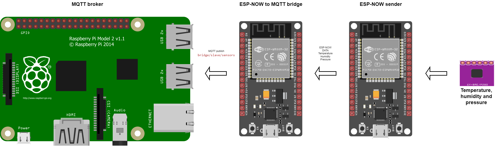
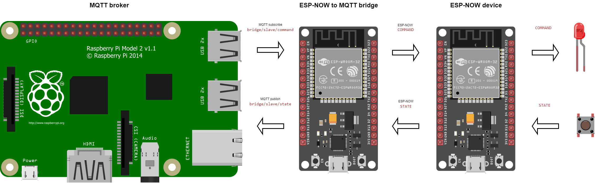

# FoxHomeIoT-ESP

## Překlady

- [Anglicky](README.md)

## Obsah

- [Popis](#popis)
- [Přehled komunikace](#přehled-komunikace)
- [Podporované ESP](#podporované-ESP)
- [Podporované čidla](#podporované-čidla)
- [Zdroje](#zdroje)

## Popis

Programy pro desky ESP32 a ESP8266, sloužící k přenosu dat z míst, kde není dobrý / žádný signál wifi. K přenosu dat, např. z připojených čidel, dochází pomocí protokolu ESP-NOW, který je možné využít na dlouhé vzdálenosti (Espressif uvádí až 450m) a i v místech bez wifi signálu. Přenos dat probíhá z odesílatele na bridge odkud je následně publikován přes MQTT (další možnosti zpracování např.: Home Assistant, Node Red...). Program podporuje automatické párování klienta s bridgem. Přenos probíhá i obrácen pro možnost spuštní připojených zařízení (např. relé).

## Přehled komunikace

### Data ze senzorů

### Řízení zařízení

## Podporované ESP

 - ESP32
 - ESP8266 - jen beta, netestováno

## Podporované čidla

 - BME280
 - programy je možné upravit, tj. je možné připojit jakékoliv čidla, která dané desky podporují

## Zdroje
 - <a href="https://randomnerdtutorials.com/esp-now-auto-pairing-esp32-esp8266/">https://randomnerdtutorials.com/esp-now-auto-pairing-esp32-esp8266/</a>
 - <a href="https://github.com/Servayejc">https://github.com/Servayejc</a>
 - <a href="https://www.espressif.com/">https://www.espressif.com/</a>
