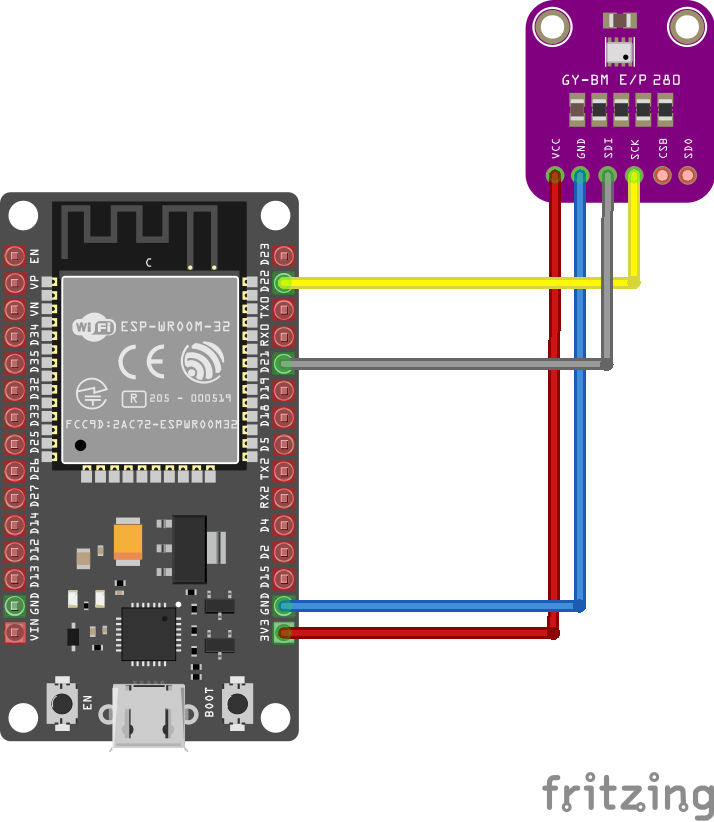
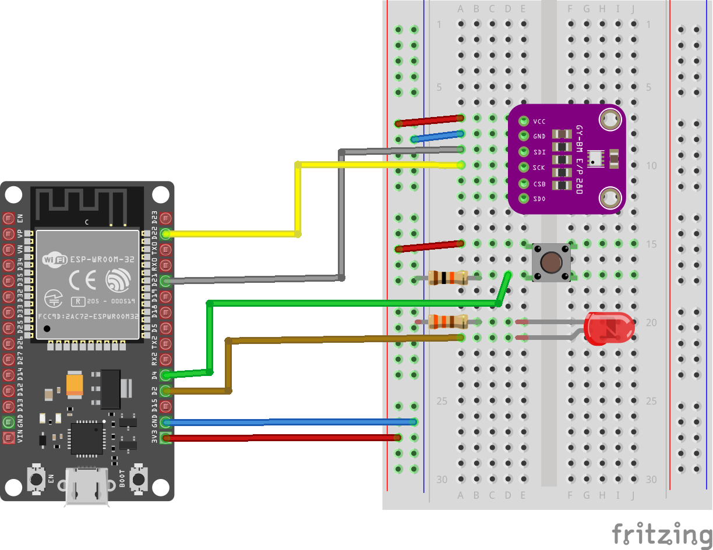
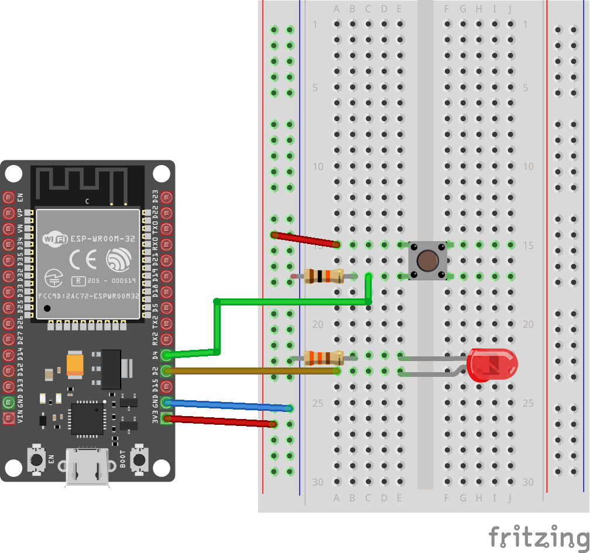

# FoxHomeIoT-ESP

## Překlady

- [Anglicky](README.md)

## Obsah

- [Popis](#popis)
- [Přehled programů](#přehled-programů)
- [Přehled komunikace](#přehled-komunikace)
- [ESP-NOW popis komunikace](#ESP-NOW-popis-komunikace)
- [MQTT popis komunikace](#MQTT-popis-komunikace)
- [Zdroje](#zdroje)

## Popis

Programy pro desky ESP32 a ESP8266, sloužící k přenosu dat z míst, kde není dobrý / žádný signál wifi. K přenosu dat, např. z připojených čidel, dochází pomocí protokolu ESP-NOW, který je možné využít na delší vzdálenosti a i v místech bez wifi signálu. Přenos dat probíhá z odesílatele na bridge odkud je následně publikován přes MQTT (další možnosti zpracování např.: Home Assistant, Node Red...). Program podporuje automatické párování klienta s bridgem. Přenos probíhá i obráceně pro možnost spuštní připojených zařízení (např. relé).

## Přehled programů

## FoxHomeIoT-Bridge

- [FoxHomeIoT-ESP32-Bridge](../FoxHomeIoT-Bridge/FoxHomeIoT-ESP32-Bridge/FoxHomeIoT-ESP32-Bridge.ino)

- [FoxHomeIoT-ESP32-Bridge-sensor](https://github.com/kuca171/FoxHomeIoT-ESP/blob/main/FoxHomeIoT-Bridge/FoxHomeIoT-ESP32-Bridge-sensor/FoxHomeIoT-ESP32-Bridge-sensor.ino)

    **Součástky**
    
        - ESP32
        - BME280

    **Schéma zapojení**

    

        VCC – 3.3V
        GND – GND
        SDI (SDA) – GPIO21
        SCK (SCL) – GPIO22

## FoxHomeIot-Sender

- [FoxHomeIot-ESP32-Sender-device-sensor](../FoxHomeIot-Sender/FoxHomeIot-ESP32-Sender-device-sensor/FoxHomeIot-ESP32-Sender-device-sensor.ino)

   **Součástky**

      - ESP32
      - BME280
      - Tlačítko
      - LED
      - 330Ω odpor
      - 10kΩ odpor
    
   **Schéma zapojení**
   
   
   
    *Zapojení BME280*
      
         VCC – 3.3V
         GND – GND
         SDI (SDA) – GPIO21
         SCK (SCL) – GPIO22

- [FoxHomeIot-ESP32-sender-sensor](../FoxHomeIot-Sender/FoxHomeIot-ESP32-sender-sensor/FoxHomeIot-ESP32-sender-sensor.ino)

   **Součástky**
    
        - ESP32
        - BME280

    **Schéma zapojení**

    

        VCC – 3.3V
        GND – GND
        SDI (SDA) – GPIO21
        SCK (SCL) – GPIO22

- [FoxHomeIot-ESP32-sender-device](../FoxHomeIot-Sender/FoxHomeIot-ESP32-sender-device/FoxHomeIot-ESP32-sender-device.ino)

   **Součástky**

      - ESP32
      - Tlačítko
      - LED
      - 330Ω odpor
      - 10kΩ odpor
    
   **Schéma zapojení**
   
   

- [FoxHomeIot-ESP8266-Sender](../FoxHomeIot-Sender/FoxHomeIot-ESP8266-Sender/FoxHomeIot-ESP8266-Sender.ino)

## Přehled komunikace

### Data ze senzorů

### Řízení zařízení

## ESP-NOW popis komunikace

## MQTT popis komunikace

## Zdroje
 - <a href="https://randomnerdtutorials.com/esp-now-auto-pairing-esp32-esp8266/">https://randomnerdtutorials.com/esp-now-auto-pairing-esp32-esp8266/</a>
 - <a href="https://github.com/Servayejc">https://github.com/Servayejc</a>
 - <a href="https://www.espressif.com/">https://www.espressif.com/</a>
