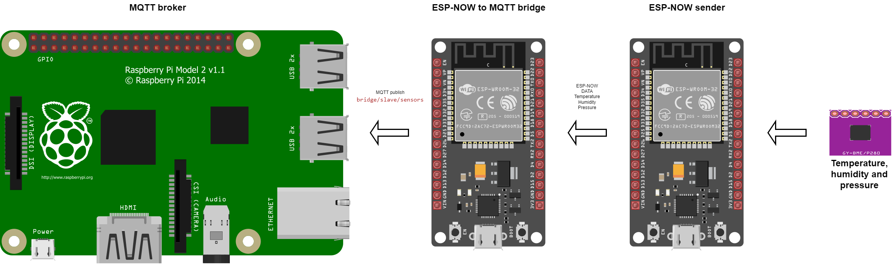
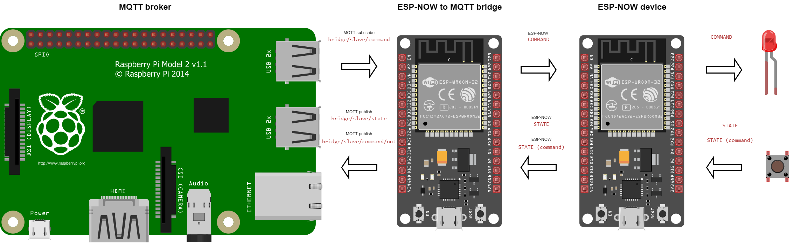

# FoxHomeIoT-ESP

## Translation

- [Czech](README.cz.md)

## Content

- [Communication overview](#communication-overview)
- [Description](#description)
- [Supported ESP device](#supported-esp-device)
- [Supported sensors](#supported-sensors)
- [Resources](#resources)

## Description

Programs for ESP32 and ESP8266 boards, used to transfer data from places where there is no good / no wifi signal. Data is transmitted, e.g. from connected sensors, using the ESP-NOW protocol, which can be used over long distances (Espressif states up to 450m) and even in places without a Wi-Fi signal. Data is transferred from the sender to the bridge, from where it is subsequently published via MQTT (other processing options, e.g.: Home Assistant, Node Red...). The program supports automatic pairing of the client with the bridge.

## Communication overview

### Reading sensors

### Device control

## Supported ESP device

 - ESP32
 - ESP8266 - only beta not tested

## Supported sensors

 - BME280
 - you can modify the source code and add your own sensors

## Resources
 - <a href="https://randomnerdtutorials.com/esp-now-auto-pairing-esp32-esp8266/">https://randomnerdtutorials.com/esp-now-auto-pairing-esp32-esp8266/</a>
 - <a href="https://github.com/Servayejc">https://github.com/Servayejc</a>
 - <a href="https://www.espressif.com/">https://www.espressif.com/</a>